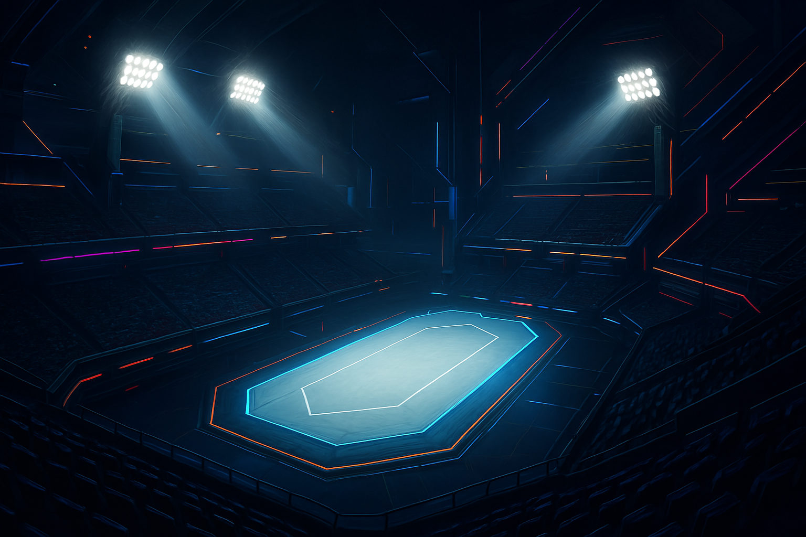
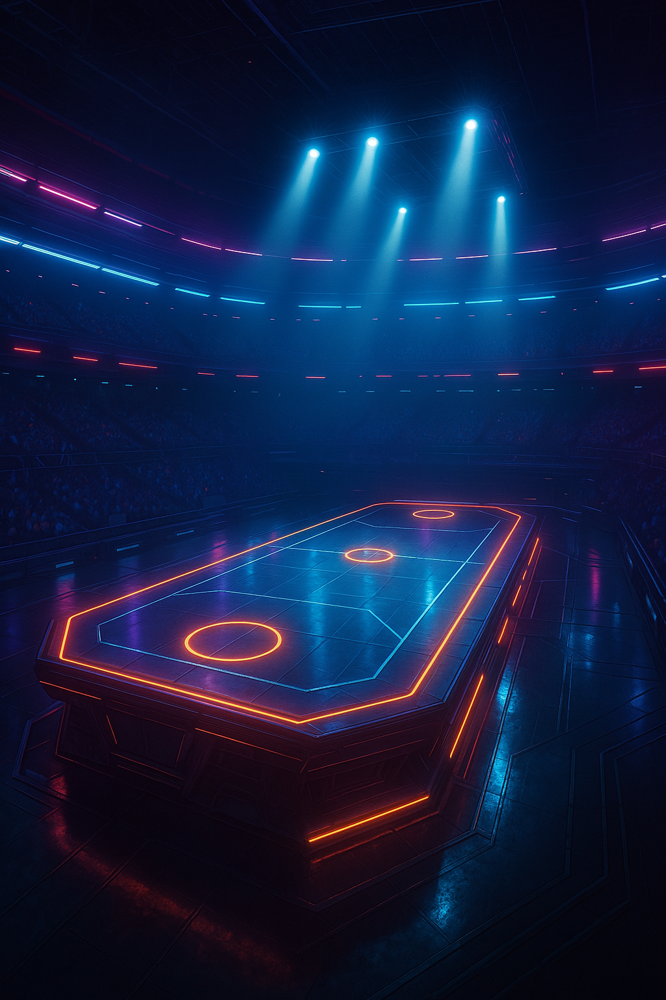
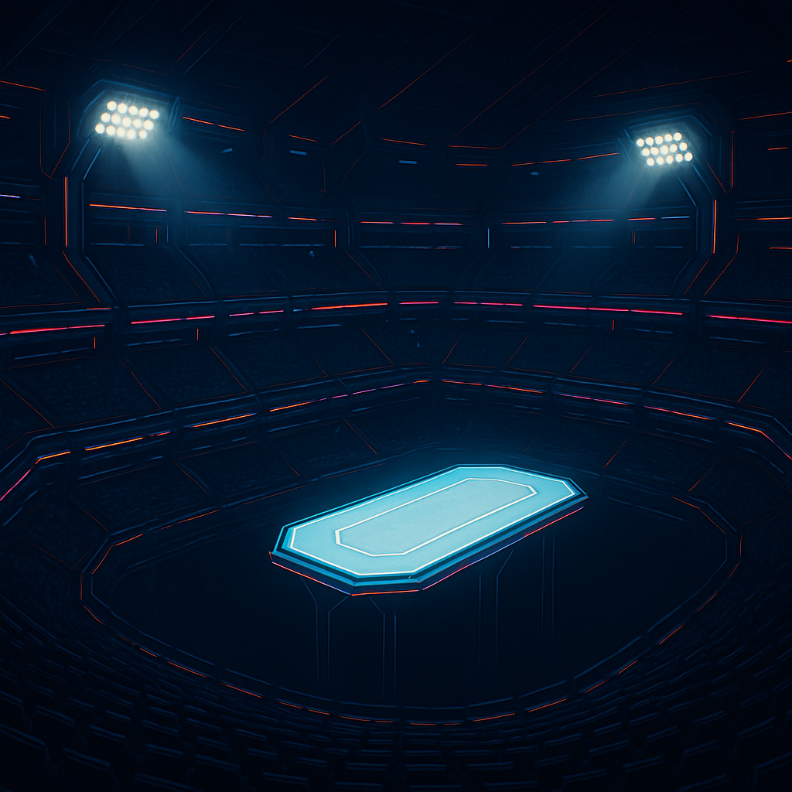
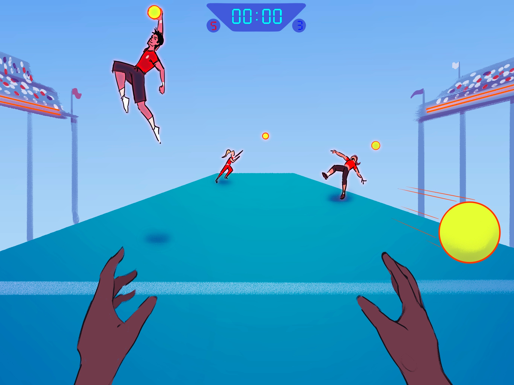
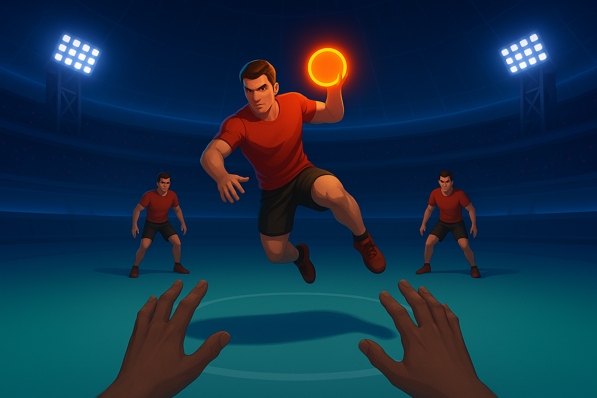
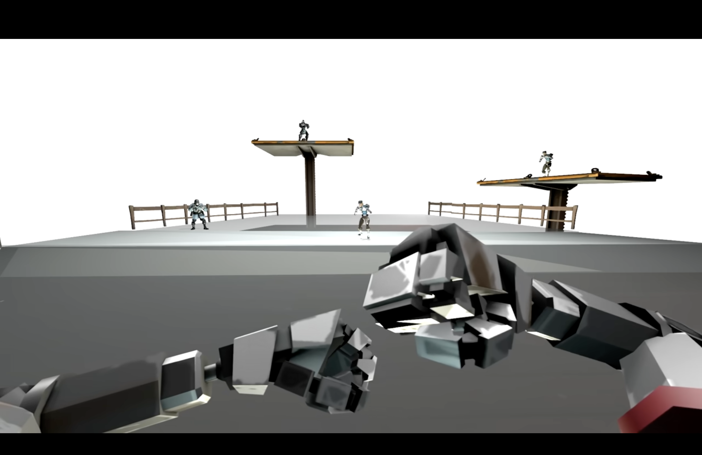

# Chaos DodgeBall

Fast-paced, first-person team dodgeball chaos with unique characters and abilities and quick reaction events.

## about the game

Imagine a party pvp minigame meets a first person shooter meets dodgeball. this game is a fast paced multiplayer dodgeball fighter/shooter set on a raised platform in a neon lit arena where you have to time dodges, choose and use abilities, and collect powerups to eliminate the other team. the game focuses on fluid and fun movement while trying to capture the fun/frustration of a party game as well as the competetiveness of a first person shooter like overwatch, halo, splitgate, or krunker. the target audience is any casual or competetive gamer that likes the feeling of fast paced first person shooter games with quick and responsive movement. it should be really fun to play/motivating to win and the mechanics should feel rewarding and engaging. Main game mode is a quick (3 minute) best 2/3 deathmatch where a team gets a point if they wipe out or have more players by the end of time than the other team. Tied @ end of regulation triggers overtime where stage starts deteriorating.

## features basic overview

- first person perspective
- fluid movement, making a responsive and quick game
- multiplayer (1v1, 2v2, 3v3, 4v4) dodgeball
- unique character abilities
- charged ultimate ability/throw
- quick time event inspired showdown dodge feature
- slow mo replays and highlights like rocket league or overwatch, enhancing competitive vibe and gloating opportunity
- powerups for added chaos and chance for tables to turn
- varied maps with moving features like super smash bros -- different map pools for more competitive modes
- optional vanilla or powered modes

## gameplay

- players spawned on opposite ends of a raised platform above a void in a large neon lined arena.
  - teams: There will be a line in the middle between the two teams with balls starting spawned on the line
  - single: everyone spawns in a seperate place around the edge of the arena, hunger games style, with balls in the middle.
- each player has 2 lives, which are lost by being hit with a ball. After they are lost, they are out and spectate. Spectators are placed on an invisible platform around the arena which they can walk around and watch the game. If a ball bounces off the platform and a spectating player catches the ball, they are spawned back into a corner of the arena with 1 life.
- a few balls (half of the total amount of players in the game) start in the center of the field, and a timer at the top of the screen counts down to start the game. Once players pickup a ball they have to wait 2 seconds before they can start to throw it.
- when a player has a ball, they can either quick throw, a throw with less speed and accuracy, or go into an aiming state described below.
- when a player has a ball, they can go into an aiming state either from the ground or mid jump. if in the air, pause in the air where they are, hovering, if on the ground, movement speed reduced (more suseptible to enemy throws). this aiming state gives a chace for the players on the other side to anticipate the throw and try to dodge it. the player throwing can pump fake to try and draw out a dodge and the player dodging has a dodge left right, duck or jump on a cooldown, so they have to anticipate a throw vs a pump fake.
- after balls are thrown, they will bounce around the ground of the arena, but if one falls off the side of the arena, it will respawn in the center.
- catching/knocking balls --> this would be a fun feature that could be implemented by giving users a short time frame and a small target that players would have to click on to be able to catch/knock balls. Knocking would have a slightly larger target. If the player clicks within the target while not holding a ball, they will catch the ball. If the player clicks on the target while holding a ball, they knock the ball away, resulting in no hit. The location of the target that the player has to click on is based on where the ball is approaching the player. If it's approaching the players head, it will appear at the top of the screen, their legs, the bottom of the screen, etc.
- if a player on your team gets hit by a ball or blocks an incoming ball with their own, it will fly in a random direction and slow down, you can catch it with the standard skill to keep the hit player in and the thrown player to lose a life. catching a ball also gives one life back to an out player (first player to get out) or the lowest health player on the team.
- teams/players also cannot horde balls, and they will go to the other team if held too long. (if more than 80% of the balls are on one side for 10 seconds it will spawn but in the middle of the other side of the arena nearest the enemy team)
- dodgeballs also have a bit of knockback, so they can push an enemy off the stage to immediately eliminate both their lives
- modifiers --> at the start of each non-competitive round, a random modifier will be applied. Modifiers will enable at a random time in the round, for a set amount of time based on the modifier.

## LINES 38-66 ARE BRODY'S EDITS THAT DIDN'T GET ADDED THE FIRST TIME

## about the game

Imagine a party pvp minigame meets a first person shooter meets dodgeball. this game is a fast paced multiplayer dodgeball fighter/shooter set on a raised platform in a neon lit arena where you have to time dodges/catches/knocks, choose and use abilities, and collect powerups to eliminate the other team. the game focuses on fluid and fun movement while trying to capture the fun/frustration of a party game as well as the competitiveness of a first person shooter like overwatch, halo, splitgate, or krunker. The target audience is any casual or competitive gamer that likes the feeling of fast paced first person shooter games with quick and responsive movement. It should be really fun to play/motivating to win and the mechanics should feel rewarding and engaging.

## features basic overview

- first person perspective
- fluid movement, making a responsive and quick game
- multiplayer (1v1, 2v2, 3v3, 4v4) dodgeball
- unique character abilities
- charged ultimate ability/throw
- buttons/keys to dodge, jump, crouch, etc
- slow mo replays and highlights like rocket league or overwatch, enhancing competitive vibe and gloating opportunity
- powerups for added chaos and chance for tables to turn

## gameplay

- players spawned on a raised platform above a void in a large arena, with rotating maps. Each arena has a theme (space, aqauatic, etc). they are all the same size, with a dividing line in the middle. different arenas have different terrain/structures to add more strategy to the game. an example could be a tree to hide behind or a bounce platform that launches the player up.
- each player has 2 lives, and after they are lost, they are out and spectate (possiblity to get back in?). spectators are free to fly around the arena while being hidden from the alive players, like in minecraft.
- a few balls (half the number of players) start in the center of the field. once the game starts, players all run to the balls and try to grab them before the enemy can. there is a 5 second grace period after the first ball is grabbed.
- when a player has a ball, they can either a throw animation where they need to time their click(s) in order to determine the speed and accuracy of their throw.
- when a player is in an aiming state, their movement speed is reduced (in air and on the ground). this aiming state gives a chance for the players on the other side to anticipate the throw and try to dodge it, or hit them while they are vulnerable. the player throwing can pump fake to try and draw out a dodge and the player dodging has a dodge left right, duck or jump on a cooldown, so they have to anticipate a throw vs a pump fake.
- after balls are thrown, they dont fly/fall off the arena/platform like players could, instead kept in by an invisible wall that only affects the balls
- players can catch dodgeballs using a special mechanic. when the ball is approaching them, a small dot will appear on their screen. it will disappear after a short amount of time (say 1 second). if they are able to click on the dot in time, it allows them to catch the ball. The location of the dot on the screen depends on what part of the player's torso the ball is headed for. A ball headed for the chest will make a dot in the middle of the screen, rendering it easy to catch, whereas towards the extremities will be farther up down or to the side, making it harder to catch. A player can also knock the ball away if they have a ball in their hand. The functionality is the same as catching the ball, just with a slightly larger target. If a player has a ball, they can also choose to catch it, but it will be more difficult, so the target will be smaller than normal.
- at a random time around halfway through the game, a powerup will spawn on the centerline and if a player hits it with a ball or touches it physically, it will activate for the team.
- teams/players also cannot hoard balls, and they will go to the other team if held too long (about 1 minute)
- dodgeballs also have a bit of knockback, so they can push an enemy off the stage

## interface

- timer in top middle with player counts on each side of the time for each team.
- Underneath the timer is the amount of lives that you have (2 hearts minecraft style and if you lose one then that heart becomes blacked out)
- On the top left hand side there is an opaque board with all your teammates profile pictures and the amount of lives they have left next to them.
- At very bottom of screen is your ultimate ability charge bar.
- timer should last for 3-5 minutes dependent on play testing; start with 4 minutes

## Power system

- players can choose between three characters, each with a unique power and the same ultimate throw that charges up .
  - ultimate throw: ultimate ability that charges up over a while and can be activated like smash bros or overwatch, giving their next throw even faster speed (visualized by on fire ball and 2x the speed (test)) and more time in the aim state (1.5x to start by test this). this throw also has much more knockback and can knock players off the stage more easily.
  - this knockback is relevant when the user catches or knocks the ball. If the ball hits the user, the user is eliminated. However, if the opposite-sided user catches or knocks the ball, they will also be knocked back, meaning they might get knocked off the map. This should move the user back by the height of 2 players for a catch and by the height of 1 player if the user knocks it.
  - character 1: architect
    - can summon temporary walls to hide behind for a few seconds with a long cooldown
    - twice the height of the user and 3x the width of the user
    - lasts for 5 seconds
  - character 2: trickster
    - can go invisible and create a decoy in their place that goes into the aim animation.
    - invisible for 10 seconds
  - character 3: aggressor
    - ability to set ball on fire, leaving a temporary trail of flames on the ground wherever the ball is thrown that doesnt do damage but players cannot cross and will be knocked back from it, creating a way for the aggressor to crowd/herd the enemy team. fire ball also does more knockback with an explosion doing splash knockback.
    - the trail of flames lasts for 15 seconds(test this)
    - however, the user gets this ability for 35 seconds(test)
    - The knockback effect is the same as ultimate throw.
    - because this shouldn't look like ultimate throw, the flame on the ball is much smaller, and is only really visualized when it hits the ground ( could also make this ice to make it more visible and obvious)
    - If the explosion hits a player with a splash knockback, this knockback does no damage and should only move the player back by 1 player height length
  - character 4: speedster
    - has the ability to slow down time for any balls headed towards them. The downside of this is that it also slows down the player so that if anyone else throws a ball at them, they are very slow to dodge.
    - Cooldown afterward lasts for 45 seconds.
    - they can slow down time for 5 seconds.
    - once used, cooldown starts again.
    - can set a spin to any ball they throw by adjusting a point placed on a ball picture (similar to 8 ball mobile game)

## powerups

Powerups appear as floating items that are randomly spawned around the map, making sure to be evenly placed on either side(one on your side one on the other side)

- time slow:
  - when collected, a 10 second period starts where the other team's movement and thrown balls will be slower
  - movement 1.5 x slower, thrown balls 1.75 x slower (test)
- hunt:
  - when collected, each player on that team gets a player on the other team to "hunt" for a certain amount of time. if they hit their target, their targets lives go to zero. Their targets will be shown on their screen and above their heads so the opposing team can see who is hunting who. This powerup lasts for 10 seconds.
- golden ball:
  - when collected, a for 5 seconds, the balls turn golden and immediatley do full health damage instead of one life
- ballstorm:
  - when collected, a rain of dodgeballs spawns on your side of the arena, which can be picked up by your team and will not damage you when it falls from the sky, all created balls despawn after 15 seconds
- firechain:
  - any time you hit an opponent on the other with a ball, it causes a mini-explosion that can damage anyone in a small radius around the hit player for a certain amt of time (undeceided, was originally 30s, but I think thats too long).
- glock:
  - one person just gets a gun (up to interpretation)
- hugh: ^^^^^^^^^^^^^^^^
  - all textures become hugh's face (ask tyler hugh and luca ig)
- push out --> lets users push the center line closer to the opponents, allowing them to get closer to their opposition

## arena events

- at the start of the round, players should be able to vote for modifiers/environmental events to spice up the games
- the modifiers will randomly be active for a fixed amt of time during the match
- events will be announced with a countdown 5 seconds before they occur so players can prepare
- VERY LOW g: gravity will be turned down very low temporarily, causing players to just freely bounce around in the arena
- trampoline: the arena turns bouncy
- watch your step: parts of the floor get outlined in red before temporarily disappearing shortly after, making it possible for players to fall through and be eliminated.

## other gamemodes??

- battle royale: everyone for themselves, larger arena, some obstacles (based on theme of arena)
- boss battles: everyone is on the same team fighting an AI dodgeball monster. This monster will have a certain amt of health and each dodgeball hit will contribute to taking it down. there will be critical points on the monster that do more damage than others. for example, a headshot does more damage than a leg shot.
- capture the flag: to win, a team must bring a flag on the opposing side back towards their own side for a certain amount of time without getting out. getting out respawns you to your side
- ranked mode --> allow players to compete with one another in a more competitive environment. No random events, players are put on a random map. Possibility of adding elo and matchmaking, assigning players of similar elo (skill level) together if the game has enough players to always allow for a player to queue within their group (a range of elos in which all players of those skill levels are matched together).

## cosmetics (MERGE TYLER'S EDITS INTO THIS AND STUFF ABOVE)

- perhaps these can be bought with currency from winning games, or they are just given randomly after a game is won
- add cosmetics like skins, emotes, taunts, victory/loss animations, kill animations, icons, etc.

## stats

- players can see how many eliminations they have, how many deaths they have, assists (if a player passes another player a ball within 10 seconds of an elemination), K/D, points (a calculation based on the players stats, TBD). in their profile in the menu
- the menu is a counter-strike, valorant style hud that appears when the user presses tab
- after matches are over, an mvp can be crowned based on the player with the most points, and other titles can be awarded, highlighting the player with the highest of each statistc

## maps

- Add TBD map designs

## Concept images:

### Arena:

### POV:

## Extra Ideas:

-Graveyard Zone: when a player dies, they respawn on a thin straight platform behind their teammates where the catching ability has no cooldown. The platform should stretch the entire back side of both ends and should be wide enough for 4 steps. If they can catch a ball that is flying off the map, they respawn back into the game. The graveyard zone should be surrounded by invisible walls so the dead player cannot fall off or couldn't influence the game with abilities but, dodgeballs should pass though the barrier to be caught. Apart from physically restraining the player, the gameplay in the graveyard zone should be identical to standard play (abilities, movement, ect. are all used normally).
-Balls will fall off the map and respawn in the middle once they hit a zone below the map
-Players ragdoll when they get hit and have an animation upon death that can be changed by the dead player with skins(fireworks, skull, ghost, ect.)
-Stage Progression. During overtime, the platform starts crumbling and shrinking, making it harder to dodge balls and making players more wary of their own steps. The dimentions of the stage shrink 5% every 30 seconds with a minimum size of 10% of original dimentions.

> > > > > > > origin/BjornBranch

-Curveball techniques: The spin/curve of the ball can be changed before the ball is thrown using joystick/arrow keys can create curving spins for more unique shots. The player can press a button to enable spin editing and it will be visualized by moving a dot on a dodgeball in the bottom right corner. The dot at the bottom will be backspin, left will be left-spin, ect. The dot will be able to move in 2 dimensions so angular spin is possible (45 degrees, 128 degrees, ect.) The ball will curve in the air based on the spin, leading to enable hitting people around corners and more difficult catches. The spin will not be reflected in the crosshair so the player must approximately adjust based on the spin they set

-Cosmetics:
Ball trails, default goes from yellow to red based on the speed of the ball, fire and ice skins can be purchased. They linger for a bit then go away.
Death animations, default is blank but players can add fireworks that explode upon death, a ghost that comes out of their corpse
